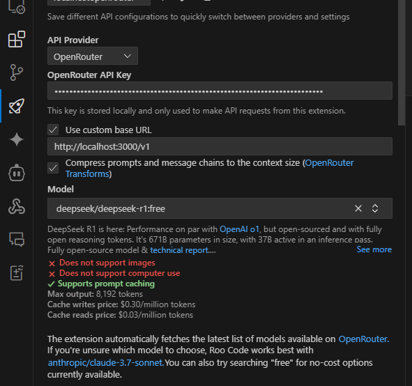
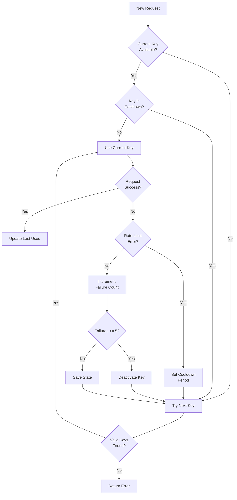
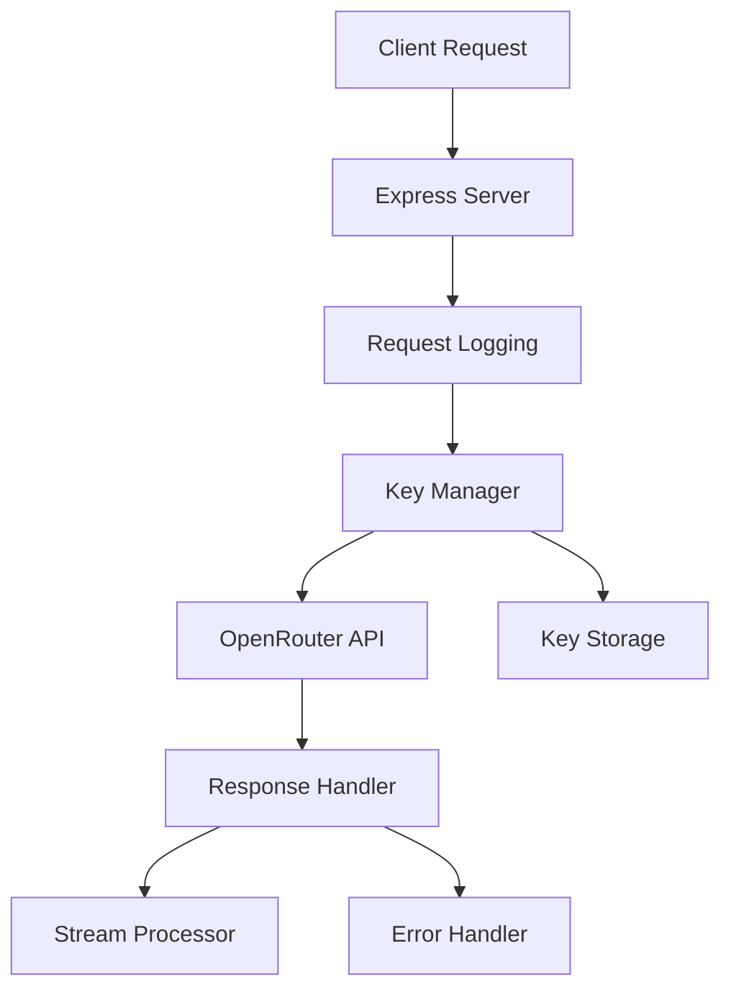

# OpenRouter Proxy Server



> A proxy server that makes OpenRouter's free models more reliable by handling API key rotation and rate limiting

## Why Use This?

When using OpenRouter's free models like DeepSeek Chat, you often encounter rate limits that can disrupt your workflow. This proxy server solves that by:

1. **Managing Multiple API Keys**: Automatically rotates between your API keys when rate limits are hit
2. **Keeping Services Running**: Tools like Aider and Roo-Code can keep working without interruption
3. **Handling Failures Gracefully**: Smart retry logic and automatic recovery from errors
4. **Being OpenAI Compatible**: Works as a drop-in replacement - just change the base URL

## Quick Start

1. **Get API Keys**: Get one or more free API keys from [OpenRouter](https://openrouter.ai)

2. **Install & Run**:
```bash
git clone https://github.com/nexon33/Openrouter-Proxy-Server
cd Openrouter-Proxy-Server
npm install
node add-key.js  # Add your API keys when prompted
node server.js
```

3. **Use with Your Tools**:
- For Aider: `aider --openai-api-base http://localhost:3000/v1`
- For Roo-Code: Update settings with base URL `http://localhost:3000/v1`
- For OpenAI SDK:
```javascript
const openai = new OpenAI({
  baseURL: 'http://localhost:3000/v1',
  apiKey: 'dummy-key'  // Real keys managed by proxy
});
```

[](https://nodejs.org/)
[]()

## ✨ Features

| **Key Management** 🔑         | **Streaming** 🌊           | **Observability** 📊         |
|-------------------------------|---------------------------|-----------------------------|
| Smart API key rotation         | Full streaming support    | Comprehensive logging       |
| Sticky session optimization    | Automatic retry logic     | Daily log rotation          |
| JSON-based storage             | Connection management     | Error tracking              |
| Rate limit handling            | Chunk processing          | Key status monitoring       |

## 📦 Getting Started

### Prerequisites
- Node.js 16+
- OpenRouter API key(s)

```bash
git clone https://github.com/yourrepo/Openrouter-Proxy-Server.git
cd Openrouter-Proxy-Server
npm install
```

## 🛠 Configuration

1. **Add API keys** using the interactive script:
```bash
node add-key.js
```

2. **Configure environment** (`.env`):
```env
PORT=3000  # Default port
LOG_RETENTION_DAYS=14  # Keep logs for 14 days
```

3. **Start the server**:
```bash
node server.js
```

## 🚀 Usage Examples

### JavaScript Client
```javascript
const openai = new OpenAI({
  baseURL: 'http://localhost:3000/v1',
  apiKey: 'dummy-key' // Actual key managed by proxy
});

// Streaming response
const stream = await openai.chat.completions.create({
  model: 'deepseek/deepseek-chat:free',
  messages: [{ role: 'user', content: 'Hello' }],
  stream: true
});

for await (const chunk of stream) {
  process.stdout.write(chunk.choices[0]?.delta?.content || '');
}
```

### cURL Example
```bash
curl -X POST http://localhost:3000/v1/chat/completions \
  -H "Content-Type: application/json" \
  -H "Authorization: Bearer dummy-key" \
  -d '{
    "model": "deepseek/deepseek-chat:free",
    "messages": [{"role": "user", "content": "Hello"}]
  }'
```

## 🔄 Key Rotation Strategy



The key rotation system implements:

- **Sticky Sessions**: Uses same key for consecutive requests when possible
- **Smart Cooldown**: Rate-limited keys enter cooldown based on rate limit headers
- **Failure Tracking**: Keys are deactivated after 5 consecutive failures
- **Age-based Selection**: Rotates to least recently used available key
- **Automatic Recovery**: Keys automatically reactivate after cooldown period
- **Key Reactivation**: Deactivated keys can be re-added through admin API

## 📚 Documentation

### API Reference

#### Chat Completions
`POST /v1/chat/completions`
- OpenAI-compatible chat completions endpoint
- Supports both streaming and non-streaming responses
- Auto-retries on rate limits (max 3 attempts)
- Headers:
  - `Content-Type: application/json`
  - `Authorization: Bearer dummy-key` (actual key managed by proxy)

#### Models List
`GET /v1/models`
- Retrieves available models from OpenRouter
- Auto-retries on rate limits (max 3 attempts)
- Headers:
  - `Authorization: Bearer dummy-key`

#### Admin API
`POST /admin/keys`
- Adds new API keys to the rotation pool
- Body: `{ "key": "your-openrouter-api-key" }`
- Protected endpoint (consider adding authentication)

### Troubleshooting

#### Common Issues

1. **Rate Limits**
   - Symptom: 429 status code
   - Solution: System automatically rotates keys and retries
   - Prevention: Add more API keys or increase request intervals

2. **Streaming Disconnections**
   - Symptom: Stream ends unexpectedly
   - Solution: 
     - Check network stability
     - Use non-streaming mode for unreliable connections
     - Implement client-side retry logic

3. **No Available Keys**
   - Symptom: "No available API keys" error
   - Solution:
     - Add new keys via admin API
     - Wait for cooldown period to end
     - Check key status in logs

4. **High Latency**
   - Symptom: Slow response times
   - Solution:
     - Add more API keys to rotation pool
     - Monitor network conditions
     - Consider server location relative to API

#### Logs Location
- `logs/requests-%DATE%.log`: Request/response details
- `logs/errors-%DATE%.log`: Error stack traces
- `logs/keys-%DATE%.log`: Key rotation events

### Architecture

#### Component Overview


#### Key Components

1. **Express Server**
   - Handles HTTP routing
   - Manages request/response lifecycle
   - Implements error middleware

2. **Key Manager**
   - Maintains key rotation logic
   - Tracks key health and status
   - Implements cooldown periods

3. **Logging System**
   - Request logging middleware
   - Error tracking
   - Key event monitoring

4. **Stream Handler**
   - Manages SSE connections
   - Processes stream chunks
   - Handles disconnections

#### Design Principles
- Separation of concerns
- Automatic recovery
- Comprehensive logging
- Efficient key utilization
- Graceful error handling

## 📜 License
MIT © Adrian Belmans - See [LICENSE](LICENSE) for details
